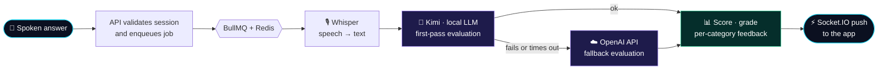

<!-- ═══════════════════════════════ HEADER ═══════════════════════════════ -->

  

  

 

  
  
  

   
  
  
  

 

<!-- ═══════════════════════════════ ABOUT ═══════════════════════════════ -->
## 🧠 About Me

I'm a full-stack engineer who builds AI-integrated, real-time products from the first schema to the release pipeline. Over the last three years at **Aditya University** I have shipped production applications on Node.js, React, React Native and MongoDB that serve **10,000+ users at 99.9% uptime**.

My work sits where backend architecture meets applied AI: event-driven services on Redis and BullMQ, live Socket.IO sessions, JWT and role-based access for multi-tenant platforms, and LLM evaluation pipelines that turn a candidate's spoken answer into a score and specific, actionable feedback.

I'm also building **[Kaziva](https://kaziva.in)**, a software products company. Its first product, **[Vaktora](https://vaktora.app)**, is an AI interview-prep app now live on Google Play.

<table>
  <tr>
    <td>🔭 <b>Currently building</b></td>
    <td>AI-powered web and mobile products at Kaziva, starting with Vaktora</td>
  </tr>
  <tr>
    <td>🌱 <b>Currently learning</b></td>
    <td>Spring Boot internals, RAG and agentic AI workflows</td>
  </tr>
  <tr>
    <td>👯 <b>Open to</b></td>
    <td>Full-stack and AI engineering roles, open-source collaboration, AI product partnerships</td>
  </tr>
  <tr>
    <td>💬 <b>Ask me about</b></td>
    <td>LLM evaluation pipelines, real-time architecture, React / React Native, scalable Node.js and Spring Boot backends</td>
  </tr>
  <tr>
    <td>⚡ <b>Fun fact</b></td>
    <td>I enjoy turning complex ideas into real-world applications</td>
  </tr>
</table>

 

<!-- ═══════════════════════════════ FEATURED WORK ═══════════════════════════════ -->
## 🚀 Featured Work

<table>
  <tr>
    <td width="33%" valign="top">
      <h3 align="center">🎯 Vaktora</h3>
      

        
      

      
<b>AI-powered interview preparation platform</b>

      
Candidates answer role-specific questions by voice. Whisper transcribes, a local Kimi model evaluates first, OpenAI takes over on failure, and a scored report with per-category feedback lands in the app over Socket.IO.

      <ul>
        <li>BullMQ workers keep evaluation off the request path</li>
        <li>5,000+ real-time events per session</li>
        <li>Redis caching cut API response times by 35%</li>
        <li>Docker + CI/CD: deploys from 45 min to under 10</li>
      </ul>
      

        <code>React Native</code> <code>Node.js</code> <code>MongoDB</code> <code>Redis</code> <code>BullMQ</code> <code>Socket.IO</code> <code>Whisper</code> <code>OpenAI</code>
      

      

        <a href="https://play.google.com/store/apps/details?id=com.vaktora.app">Google Play</a> · <a href="https://vaktora.app">vaktora.app</a> · <a href="https://hanu.kaziva.in/projects/vaktora">Case study</a>
      

    </td>
    <td width="33%" valign="top">
      <h3 align="center">🗣️ LSRW Assessment Platform</h3>
      

        
      

      
<b>AI-driven language proficiency assessment</b>

      
Listening, Speaking, Reading and Writing modules graded through the OpenAI API, with a hybrid review queue that routes subjective answers to educators for confirmation or override.

      <ul>
        <li>Objective tasks finalized automatically</li>
        <li>Educator dashboards with real-time reporting</li>
        <li>Analytics pipelines for large test sessions</li>
      </ul>
      

        <code>Next.js</code> <code>Node.js</code> <code>MongoDB</code> <code>OpenAI API</code>
      

      

        <a href="https://hanu.kaziva.in/projects/lsrw-assessment-platform">Case study</a>
      

    </td>
    <td width="33%" valign="top">
      <h3 align="center">🏦 Village Finance</h3>
      

        
      

      
<b>Multi-tenant lending & collections platform</b>

      
Expo mobile app for admins and collectors, a React platform console, and a Spring Boot 3 API with stateless JWT, per-role endpoints, weekly close, capital and partner ledgers.

      <ul>
        <li>One-phone-per-collector device binding</li>
        <li>Neon serverless Postgres via JPA / Hibernate</li>
        <li>Presigned uploads to a private Cloudflare R2 bucket</li>
      </ul>
      

        <code>Expo</code> <code>React Native</code> <code>Java 17</code> <code>Spring Boot 3</code> <code>PostgreSQL</code> <code>Cloud Run</code> <code>R2</code>
      

      

        <a href="https://hanu.kaziva.in/projects/village-finance">Case study</a>
      

    </td>
  </tr>
</table>

 

<!-- ═══════════════════════════════ AI PIPELINE ═══════════════════════════════ -->
## ⚙️ How I Ship AI Features

The evaluation pipeline behind Vaktora. Local model first, hosted model as a fallback, and one evaluation contract so the client never knows which model produced the result.

 

<!-- ═══════════════════════════════ TECH STACK ═══════════════════════════════ -->
## 🛠️ Tech Stack

**Frontend & Mobile**

**Backend & APIs**

**Data & Caching**

**DevOps & Cloud**

**AI Engineering**

**Real-time & Architecture**

 

<!-- ═══════════════════════════════ IMPACT ═══════════════════════════════ -->
## 📈 Impact

| 🏗️ Production | ⚡ Performance | 🎓 Community |
|:---:|:---:|:---:|
| **10,000+** users served at **99.9%** uptime | **40%** lower latency via event-driven backends | **700+** students mentored in MERN & React Native |
| **6** production apps led, zero critical post-launch defects | **35%** faster APIs with Redis caching | **85%+** shipped capstones and landed dev roles |
| **15+** major releases shipped on schedule | **25%** faster queries via schema and index redesign | **5** junior devs mentored, PR cycles down **30%** |

 

<!-- ═══════════════════════════════ CERTIFICATION ═══════════════════════════════ -->
## 🎖️ Certification

  
   
  B.Tech, Electronics and Communication Engineering · Aditya Engineering College · 2019 – 2023

 

<!-- ═══════════════════════════════ GITHUB STATS ═══════════════════════════════ -->
## 📊 GitHub Analytics

  

  

 

<!-- ═══════════════════════════════ CONNECT ═══════════════════════════════ -->
## 🤝 Let's Connect

  
  
  
  
  

 

  <i>“Ship the whole stack: the idea, the API, the data model, the app, and the release.”</i>

  

